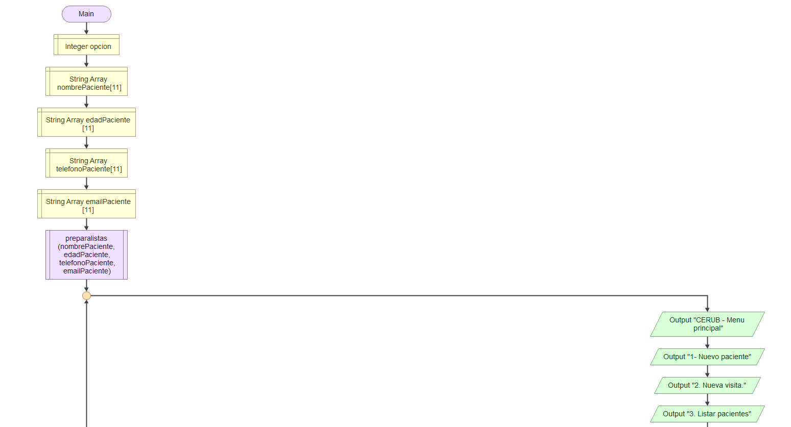
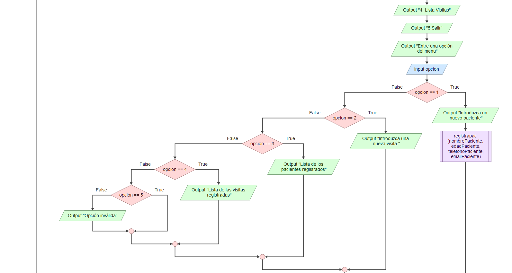
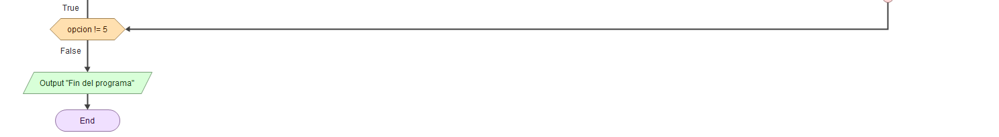
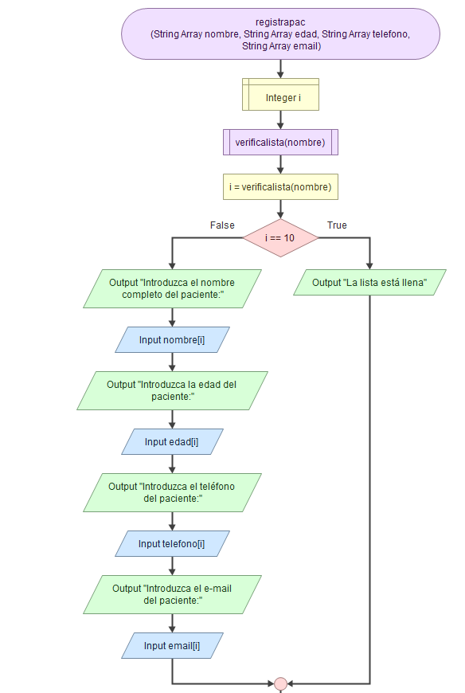
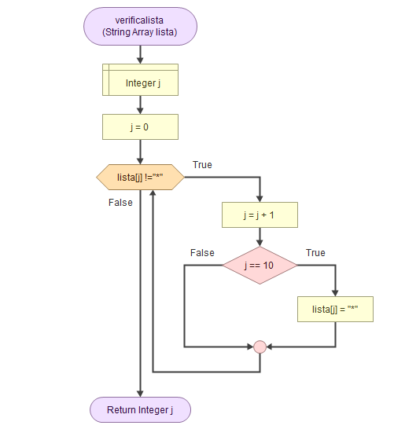

# Proyecto Final - Algoritmia y Python

    Alumno: Carlos Scarpini da Silva

    Profesor: Manu Plaza Salas

    CIFO La Violeta - Junio/2024

## Prévia del proyecto

### 1. Introducción

#### Proyecto

- Formulario digital para aplicación de medicamentos para enfermedades autoinmunes.

#### Descripción

- El proyecto consiste en digitalizar un proceso que existe actualmente en una clínica médica que trata a pacientes con enfermedades autoinmunes. Los pacientes de esta clínica necesitan recibir medicación intravenosa bajo la supervisión del médico responsable. Este seguimiento se registra en un formulario en papel y posteriormente se almacena en un archivador metálico durante al menos 15 años.
  El objetivo del proyecto es mejorar el registro y almacenamiento de esta información, digitalizando el proceso y permitiendo posteriormente un mejor control de esta información, con el fin de mejorar el flujo interno del servicio y posibilitar un mejor trato al paciente.

### 2. Requisitos

- El proyecto se desarrollará en el lenguaje Python, compatible con los sistemas operativos actuales, utilizando VSCode para implementar el código. La biblioteca JSON se utilizará para generar archivos .json para almacenar la información ingresada en el software y la biblioteca Tkinter se utilizará para crear la interfaz gráfica del programa.

### 3. Diseño del proyecto

#### Descripción del diseño

La estructura de alto nivel del código:

- main.py: Script que verifica la existencia de los archivos .json y posteriormente ejecuta la
  aplicación e interfaz gráfica del usuario.
- menu.py: El menú principal del programa, donde el usuario elegirá la operación deseada.
- gui.py: Módulo que gerencia la interfaz gráfica de programa(GUI) utilizando la biblioteca Tkinter.
- registrarpac.py: Módulo que solicitará al usuario los datos del paciente y los gravará en el archivo
  pacientes.json
- registarvis.py: Módulo que solicitará al usuario que seleccione un paciente registrado para los apuntes
  referentes a la visita que será registrada en el archivo visitas.json.
- listarpacientes.py: Módulo que mostrará en pantalla la lista de todos los pacientes registrados en el
  programa.
- listarvisitas.py: Módulo que mostrará en pantalla la lista de todas las visitas registradas en el programa.

### 4. Diagrama de flujo

- Menu principal

- Registrar paciente

- Verifica lista

